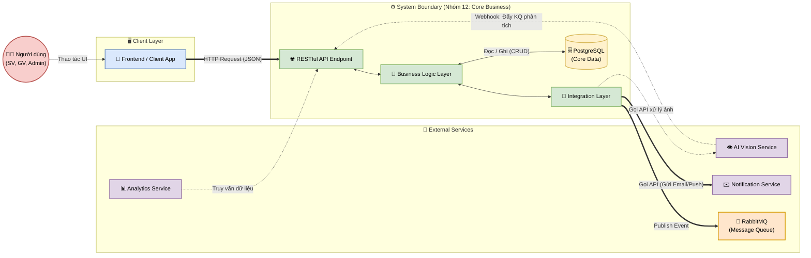

# Service Boundary của nhóm

## 1. Thông tin nhóm

- Tên nhóm: Nhóm 12 - B6
- Lớp: CNTT 17-13
- Thành viên: Bùi Thế Đạt, Nguyễn Đình Minh Hiếu, Nguyễn Công Hiệp, Nguyễn Văn Trường
- Service nhóm phụ trách: Core Business
- Sản phẩm tổng thể của lớp: Product B

## 2. Actor

- Người dùng cuối (Sinh viên / Giảng viên): Sử dụng các chức năng nghiệp vụ chính của hệ thống.
- Quản trị viên hệ thống (Admin): Quản lý cấu hình nghiệp vụ, phân quyền và giám sát hoạt động.
- Hệ thống Frontend/Client App: Giao diện web hoặc mobile gọi API nghiệp vụ.
- Các Service khác trong hệ thống (AI Vision, Notification, Analytics, ...): Gửi hoặc nhận dữ liệu nghiệp vụ thông qua API.

## 3. System Boundary

Nhóm em xây phần nào?

Phần nhóm kiểm soát:
- Core Business API: Hệ thống RESTful API trung tâm xử lý toàn bộ logic nghiệp vụ chính của sản phẩm (quản lý dữ liệu, xử lý quy trình, ra quyết định nghiệp vụ).
- Business Logic Layer: Tầng xử lý nghiệp vụ bao gồm: xác thực dữ liệu đầu vào, áp dụng quy tắc nghiệp vụ (business rules), điều phối luồng xử lý giữa các module nội bộ.
- Database Management: Thiết kế, quản lý và tương tác với cơ sở dữ liệu nghiệp vụ chính (PostgreSQL), bao gồm migration và seed data.
- Integration Layer: Tầng tích hợp chịu trách nhiệm giao tiếp với các service khác trong hệ thống thông qua REST API hoặc Message Queue.

Phần nhóm chỉ tích hợp:
- Hệ thống AI Vision: Nhận kết quả phân tích hình ảnh (nhận diện đối tượng, biển số xe, ...) để xử lý nghiệp vụ tương ứng.
- Hệ thống Notification: Gọi service thông báo để gửi cảnh báo, email, push notification đến người dùng.
- Hệ thống Authentication: Xác thực và phân quyền người dùng được quản lý bởi service riêng hoặc tích hợp qua gateway chung.
- Hệ thống Frontend/UI: Giao diện người dùng cuối do nhóm khác phụ trách.

## 4. Service Boundary

Service của nhóm có trách nhiệm gì?
- Tiếp nhận và xử lý các yêu cầu nghiệp vụ chính từ Frontend hoặc các service khác.
- Thực thi logic nghiệp vụ trung tâm: xác thực dữ liệu, áp dụng business rules, tính toán và ra quyết định.
- Quản lý vòng đời dữ liệu nghiệp vụ (CRUD) trên cơ sở dữ liệu chính.
- Điều phối luồng xử lý giữa các service phụ thuộc (gọi AI Vision lấy kết quả, gọi Notification gửi thông báo).
- Cung cấp API chuẩn RESTful cho toàn bộ hệ thống sử dụng.
- Ghi log hoạt động nghiệp vụ phục vụ audit và truy vết.

Service KHÔNG làm gì?
- KHÔNG thực hiện phân tích hình ảnh hay suy luận AI (thuộc trách nhiệm của AI Vision Service).
- KHÔNG gửi trực tiếp thông báo đến người dùng (chỉ gọi đến Notification Service).
- KHÔNG quản lý giao diện người dùng (UI/UX thuộc phần Frontend).
- KHÔNG xử lý xác thực đăng nhập (Authentication) mà chỉ kiểm tra token/quyền hạn đã được cấp.

## 5. Input / Output

### Input
- HTTP Request từ Frontend: Các request RESTful (JSON) chứa dữ liệu nghiệp vụ từ giao diện người dùng.
- API Call từ Service khác: Kết quả phân tích từ AI Vision Service, yêu cầu truy vấn từ Analytics Service.
- Message Queue Event: Sự kiện bất đồng bộ từ các service khác (ví dụ: camera phát hiện đối tượng mới).

### Output
Định dạng JSON (API Response) bao gồm:
- status: Trạng thái xử lý (success / error).
- data: Dữ liệu nghiệp vụ được yêu cầu (danh sách, chi tiết, kết quả xử lý).
- message: Thông báo mô tả kết quả.
- metadata: Thông tin phân trang, timestamp, request_id phục vụ truy vết.
- Event/Message: Phát sự kiện đến Message Queue để các service khác lắng nghe (ví dụ: đơn hàng mới, cảnh báo nghiệp vụ).

## 6. API dự kiến

| Method | Endpoint | Mục đích |
|---|---|---|
| GET | /health | Kiểm tra trạng thái hoạt động của service |
| GET | /api/v1/resources | Lấy danh sách tài nguyên nghiệp vụ (có phân trang, lọc) |
| GET | /api/v1/resources/{id} | Lấy chi tiết một tài nguyên nghiệp vụ theo ID |
| POST | /api/v1/resources | Tạo mới một tài nguyên nghiệp vụ |
| PUT | /api/v1/resources/{id} | Cập nhật toàn bộ thông tin tài nguyên nghiệp vụ |
| DELETE | /api/v1/resources/{id} | Xóa một tài nguyên nghiệp vụ |
| POST | /api/v1/process | Thực thi một quy trình nghiệp vụ (ví dụ: xử lý đơn, duyệt yêu cầu) |
| GET | /api/v1/logs | Truy vấn lịch sử hoạt động nghiệp vụ |

## 7. Phụ thuộc service khác

Service này gọi đến service nào?
- AI Vision Service: Gọi để lấy kết quả phân tích hình ảnh (nhận diện đối tượng, biển số xe) phục vụ xử lý nghiệp vụ.
- Notification Service: Gọi để gửi thông báo (email, push notification) đến người dùng khi có sự kiện nghiệp vụ quan trọng.
- Database Service (PostgreSQL): Đọc/ghi dữ liệu nghiệp vụ chính.
- Message Queue (RabbitMQ): Publish sự kiện nghiệp vụ để các service khác subscribe và xử lý.

Service nào gọi đến service này?
- Frontend / Client App: Gọi API nghiệp vụ để hiển thị dữ liệu và thực hiện thao tác người dùng.
- AI Vision Service: Gọi để đẩy kết quả phân tích cần xử lý nghiệp vụ tiếp theo (ví dụ: phát hiện vi phạm -> tạo biên bản).
- Analytics Service: Gọi để truy vấn dữ liệu nghiệp vụ phục vụ báo cáo và thống kê.

## 8. Sơ đồ minh họa

Có thể vẽ bằng Mermaid, draw.io, Ludichart hoặc ảnh chụp sơ đồ.

